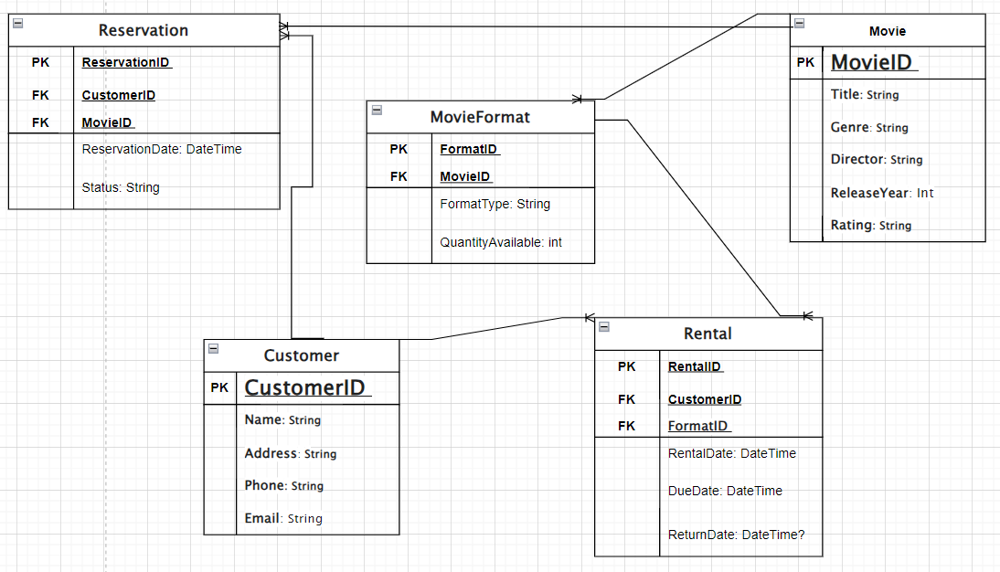

# RentalFlixERD

### ERD Image 

## Overview
RentalFlix is a web-based API developed to streamline the management of a movie rental service. This system modernizes the outdated methods of tracking movies, customers, and rentals by offering a comprehensive digital solution. RentalFlix efficiently handles movie inventory, customer data, rental records, and reservations, ensuring a seamless experience for both staff and customers.

## Problem Domain
The core objective of RentalFlix is to effectively manage movie inventory, customer information, and rental records. The system includes the following key features:

### Movie Management: Handles details about movies and their available formats.
Customer Information Storage: Maintains customer data including contact information.
Rental Tracking: Keeps records of movie rentals and returns.
Reservation Handling: Manages movie reservations for customers.
Application Specifications
### Movies:
Each movie is identified by a unique MovieID.
Movies include details such as title, genre, director, release year, and rating.
Movies are available in various formats (DVD, Blu-ray, Digital).
Each movie format has a unique identifier and may have different quantities available.
### Customers:
Each customer has a unique CustomerID.
Customer details include name, address, phone number, and email.
Customers can rent multiple movies but must return them within a specified period.
### Rentals:
Each rental is recorded, including the customer who rented the movie, the format rented, the rental date, and the due date.
The system also tracks the return date when a movie is returned.
Reservations:
Customers can reserve movies that are currently rented out.
Reservation records include the customer ID, movie ID, reservation date, and status of the reservation (active, fulfilled, canceled).
ERD Components

### Movie:
MovieID (PK): Unique identifier for each movie.
Title: The title of the movie.
Genre: The genre or category of the movie.
Director: The director of the movie.
ReleaseYear: The year the movie was released.
Rating: The movie's rating (e.g., PG, PG-13, R).

### MovieFormat:
FormatID (PK): Unique identifier for each movie format.
MovieID (FK): Identifier for the movie.
FormatType: Type of format (DVD, Blu-ray, Digital).
QuantityAvailable: Number of copies available for rent.

### Customer:
CustomerID (PK): Unique identifier for each customer.
Name: The name of the customer.
Address: The customer's address.
Phone: The customer's contact number.
Email: The customer's email address.

### Rental:
RentalID (PK): Unique identifier for each rental record.
CustomerID (FK): ID of the customer who rented the movie.
FormatID (FK): ID of the rented movie format.
RentalDate: Date when the movie was rented.
DueDate: Date when the movie is due to be returned.
ReturnDate: Date when the movie was returned (nullable).

### Reservation:
ReservationID (PK): Unique identifier for each reservation.
CustomerID (FK): ID of the customer who reserved the movie.
MovieID (FK): ID of the reserved movie.
ReservationDate: Date when the reservation was made.
Status: Status of the reservation (active, fulfilled, canceled).

### Relationships
Movie to MovieFormat: Each movie can have multiple formats (1
).
Customer to Rental: Each customer can have multiple rentals (1
).
Rental to Customer and MovieFormat: Each rental record is associated with one customer and one movie format (Many:1).
Movie to Reservation: Each movie can have multiple reservations (1
).
Reservation to Customer and Movie: Each reservation is associated with one customer and one movie (Many:1).